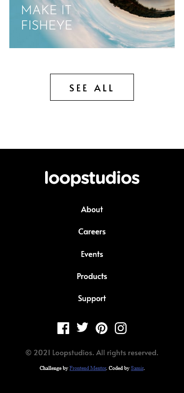
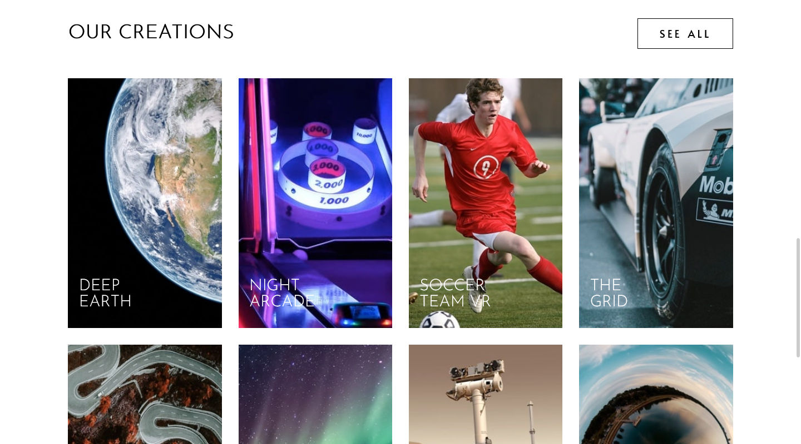
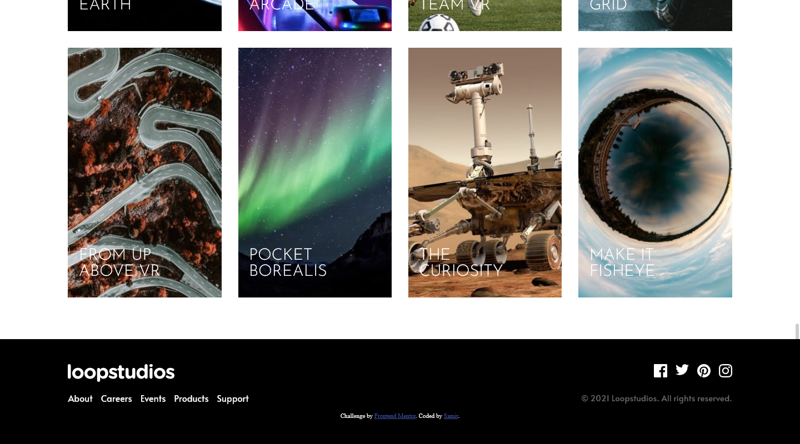

# Frontend Mentor - Loopstudios landing page solution

This is a solution to the [Loopstudios landing page challenge on Frontend Mentor](https://www.frontendmentor.io/challenges/loopstudios-landing-page-N88J5Onjw). Frontend Mentor challenges help you improve your coding skills by building realistic projects. 

## Table of contents

- [Overview](#overview)
  - [Screenshot](#screenshot)
  - [Links](#links)
- [My process](#my-process)
  - [Built with](#built-with)
  - [What I learned](#what-i-learned)
  - [Continued development](#continued-development)
  - [Useful resources](#useful-resources)
- [Author](#author)


## Overview

### Screenshot









### Links

- Solution URL: (https://github.com/samirhembrom/Frontend-Mentor---Loopstudios-landing-page-solution)
- Live Site URL: (https://frontend-mentor-loopstudios-landing-page-solution.vercel.app/)

## My process

I try to go for mobile-first workflow. I made the header and navigation first. The overflay for the navigation bar was difficult to create. I was not able to make the navigation bar take the whole width as a result the user could scroll. After searching in stackoverflow I was able to make the navigation bar take whole screen. I used flexbox for creating interactive section and footer section. The creations section was built using css grid.

### Built with

- Semantic HTML5 markup
- CSS custom properties
- Flexbox
- CSS Grid
- Mobile-first workflow


### What I learned

I learned how to make an overlay take whole width of the screen and also brushed up on my CSS grid skills. 

```js
document.getElementsByTagName('body')[0]. style .height = "100vh";
document.getElementsByTagName('body')[0]. style. overflow = "hidden";
```


### Continued development

I think I need to focus on using CSS grid more. I need to see examples everytime when I try to incorporate CSS grid.


### Useful resources

- [Example resource 1](https://css-tricks.com/snippets/css/complete-guide-grid/) - I always use css-tricks whenever I forget any layout sytax. 


## Author

- Frontend Mentor - [@samirhembrom007](https://www.frontendmentor.io/profile/samirhembrom007)
- Twitter - [@SamirHembrom11](https://twitter.com/SamirHembrom11)


